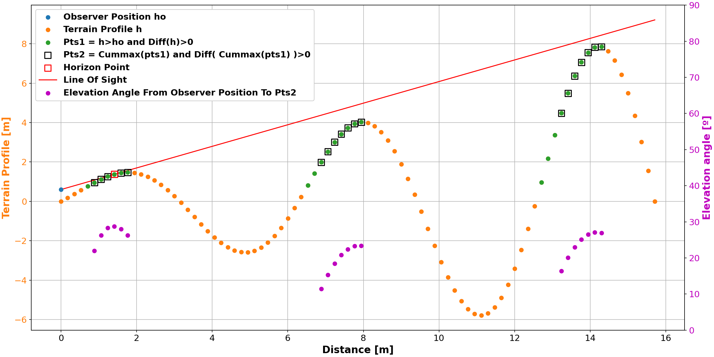
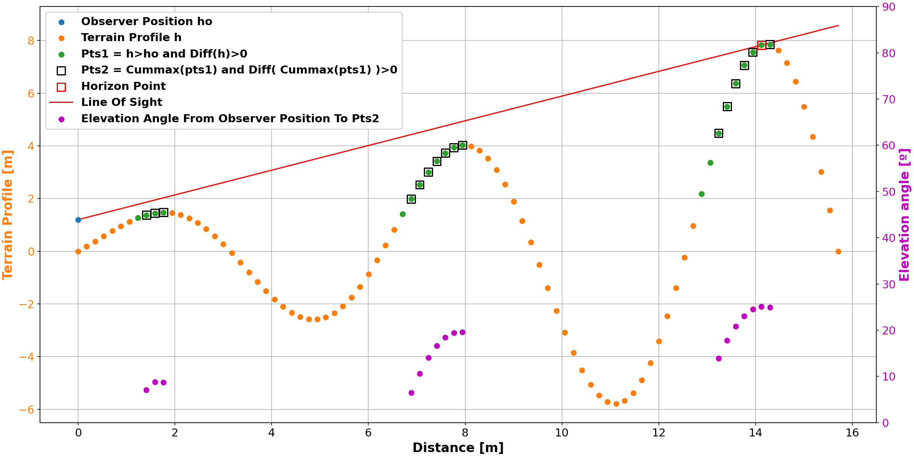

# Viewshed Analysis

## Terrain profile and line of sight
From observation point O only points A and C are visible. The line of sight between the observer and B ,D is obstructed by the terrain


## 3D comparison


## Animation


## Different observer positions


## Horizon Profile



## Broadcasting Vectorization

<sup>

```js

p0 (3,)
[2.5 6.5 5.5] 

t (5, 1, 1)
┌─────┐┌──────┐┌─────┐┌──────┐┌─────┐
 [0.0]  [0.25]  [0.5]  [0.75]  [1.0] 
└─────┘└──────┘└─────┘└──────┘└─────┘ 

X,Y,Z (3, 4)
┌─────────┐┌─────────┐┌─────────┐
 [1 1 1 1]  [4 5 6 7]  [3 2 5 4] 
 [2 2 2 2]  [4 5 6 7]  [4 3 5 6] 
 [3 3 3 3]  [4 5 6 7]  [6 2 4 6] 
└─────────┘└─────────┘└─────────┘ 

Xlos (5, 3, 4)
┌─────────────────┐┌─────────────────────────┐┌─────────────────────┐┌─────────────────────────┐┌─────────────────┐
 [2.5 2.5 2.5 2.5]  [2.125 2.125 2.125 2.125]  [1.75 1.75 1.75 1.75]  [1.375 1.375 1.375 1.375]  [1.0 1.0 1.0 1.0] 
 [2.5 2.5 2.5 2.5]  [2.375 2.375 2.375 2.375]  [2.25 2.25 2.25 2.25]  [2.125 2.125 2.125 2.125]  [2.0 2.0 2.0 2.0] 
 [2.5 2.5 2.5 2.5]  [2.625 2.625 2.625 2.625]  [2.75 2.75 2.75 2.75]  [2.875 2.875 2.875 2.875]  [3.0 3.0 3.0 3.0] 
└─────────────────┘└─────────────────────────┘└─────────────────────┘└─────────────────────────┘└─────────────────┘ 

Ylos (5, 3, 4)
┌─────────────────┐┌─────────────────────────┐┌─────────────────────┐┌─────────────────────────┐┌─────────────────┐
 [6.5 6.5 6.5 6.5]  [5.875 6.125 6.375 6.625]  [5.25 5.75 6.25 6.75]  [4.625 5.375 6.125 6.875]  [4.0 5.0 6.0 7.0] 
 [6.5 6.5 6.5 6.5]  [5.875 6.125 6.375 6.625]  [5.25 5.75 6.25 6.75]  [4.625 5.375 6.125 6.875]  [4.0 5.0 6.0 7.0] 
 [6.5 6.5 6.5 6.5]  [5.875 6.125 6.375 6.625]  [5.25 5.75 6.25 6.75]  [4.625 5.375 6.125 6.875]  [4.0 5.0 6.0 7.0] 
└─────────────────┘└─────────────────────────┘└─────────────────────┘└─────────────────────────┘└─────────────────┘ 

Zlos (5, 3, 4)
┌─────────────────┐┌─────────────────────────┐┌─────────────────────┐┌─────────────────────────┐┌─────────────────┐
 [5.5 5.5 5.5 5.5]  [4.875 4.625 5.375 5.125]  [4.25 3.75 5.25 4.75]  [3.625 2.875 5.125 4.375]  [3.0 2.0 5.0 4.0] 
 [5.5 5.5 5.5 5.5]  [5.125 4.875 5.375 5.625]  [4.75 4.25 5.25 5.75]  [4.375 3.625 5.125 5.875]  [4.0 3.0 5.0 6.0] 
 [5.5 5.5 5.5 5.5]  [5.625 4.625 5.125 5.625]  [5.75 3.75 4.75 5.75]  [5.875 2.875 4.375 5.875]  [6.0 2.0 4.0 6.0] 
└─────────────────┘└─────────────────────────┘└─────────────────────┘└─────────────────────────┘└─────────────────┘ 

Zter (5, 3, 4)
┌─────────────────────┐┌──────────────────────────────────┐┌──────────────────────────┐┌────────────────────────────────┐┌────────────────┐
 [5.25 5.25 5.25 5.25]  [4.625 5.015625 5.296875 5.578125]  [3.31 4.43  5.125  5.375 ]  [2.75 3.359  4.96875  4.78125 ]  [3.0 2.0 5.0 4.0]
 [5.25 5.25 5.25 5.25]  [4.375 4.796875 5.140625 5.484375]  [3.25 4.25  5.0625 5.6875]  [3.39 3.625  5.015625 5.859375]  [4.0 3.0 5.0 6.0]
 [5.25 5.25 5.25 5.25]  [4.125 4.578125 4.984375 5.390625]  [2.75 3.75  4.6875 5.5625]  [3.48 2.875  4.359375 5.765625]  [6.0 2.0 4.0 6.0]
└─────────────────────┘└──────────────────────────────────┘└──────────────────────────┘└────────────────────────────────┘└────────────────┘ 

┌─────────────────────────┐┌─────────────────────────┐┌─────────────────────────┐┌─────────────────────────┐┌─────────────────────────┐
 [False False False False]  [False True  False True ]  [False True  False True ]  [False True  False True ]  [False False False False] 
 [False False False False]  [False False False False]  [False False False False]  [False False False False]  [False False False False] 
 [False False False False]  [False False False False]  [False False False False]  [False False False False]  [False False False False] 
└─────────────────────────┘└─────────────────────────┘└─────────────────────────┘└─────────────────────────┘└─────────────────────────┘ 

┌─────────────────────────┐
 [False True  False True ] 
 [False False False False] 
 [False False False False] 
└─────────────────────────┘ 

┌─────────────────┐
 [3.0 nan 5.0 nan] 
 [4.0 3.0 5.0 6.0] 
 [6.0 2.0 4.0 6.0] 
└─────────────────┘
```
</sub>