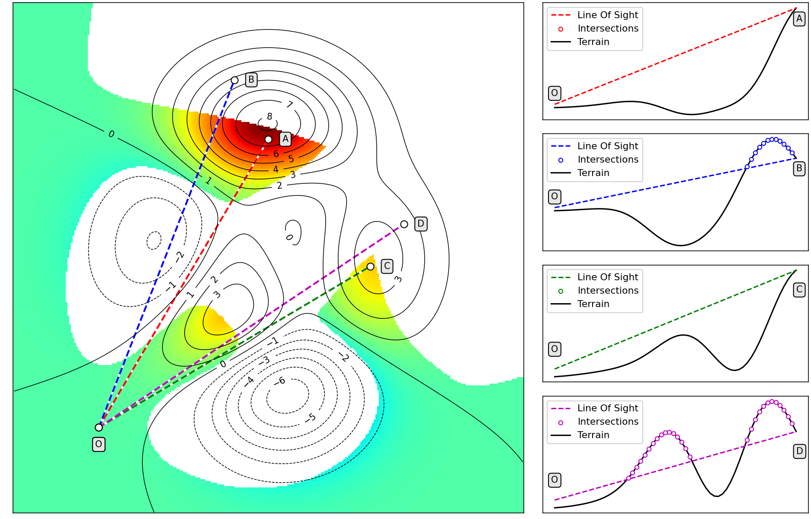

# Viewshed Analysis

## Terrain profile and line of sight
From observation point O only points A and C are visible. The line of sight between the observer and B ,D is obstructed by the terrain

## 3D comparison

## Animation

## Different observer positions

